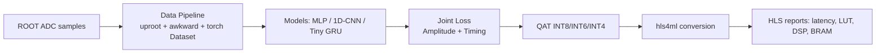

# TileCal AI Reconstruction Architecture

## Performance Axes
- Physics quality: `sigma((A_pred - A_true)/A_true)` vs pile-up.
- Latency target: below `100 ns / channel` where feasible.
- FPGA resources: LUT, FF, DSP48, BRAM utilization.
